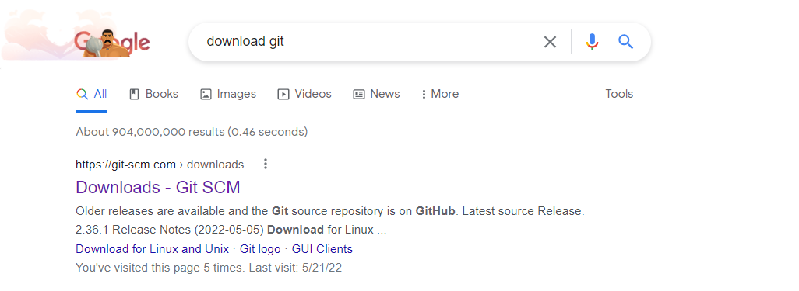
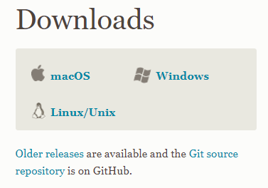
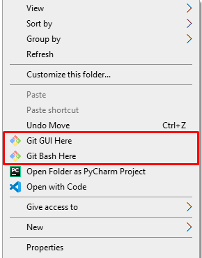
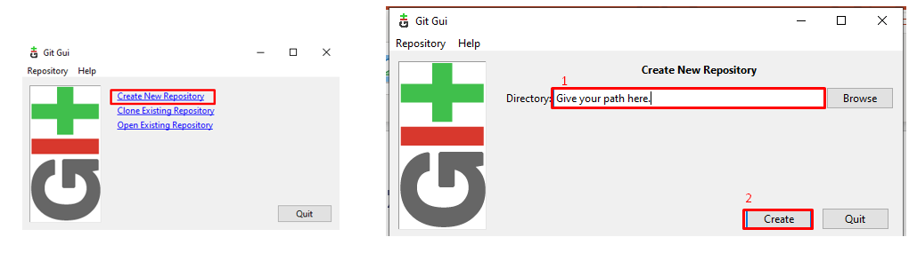
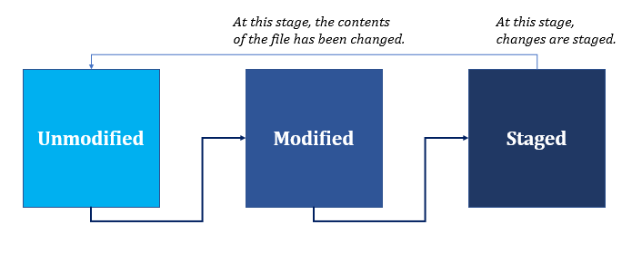
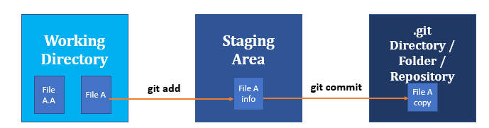
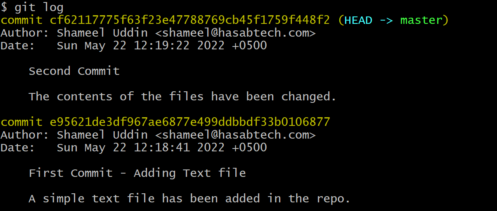

I have seen many people (beginners) asking,

> what is the difference between the Git and GitHub?

So, I think, this needs to be clarified in a proper post.

Generally, the ones, asking these questions, are not much aware of Git and the immense need of this tool, especially in the field of programming, whether it be development or some other application.

# Git - Version Control System

## Git Basics with Real World Scenario

Lets understand Git... a bit.

It is a _Version Control System_, as everyone says, but what does _VCS actually mean_?

Lets say, you are making notes of something in a simple text file, named as "notes.txt"


The notes were quite rough, so you refined it later and named it as, "notes - refined .txt"
Now, you have two files:


Lets say, you researched about a topic, or discussed it with a friend or someone asked a revision of it, and you are like me, you always want to keep a copy (i.e., history) of what you have been doing throughout your time on particular work.
So, you renamed it again:


As revisions, refinement, research and/or modifications increases, so would your files because you want to _keep track_ of what you are doing and how you are doing it.

But wait... Even after all that hassle, you can keep track of versions of files but you still cannot track what you have been editing all this time, right?

One solution could be prepare Excel file where you keep names of files in one column and description of versions on another column for proper tracking of the files and their different versions.

Now, you wish, there was some assistant of yours who could arrange all of that work but unfortunately, you are not rich like me who can afford an assistant for all of this work

```
Enters Git!
```

Now we come to a question of Git.

## What is Git ?

- Git is a version control system (VCS). It **runs locally** in the environment.

- A **free of cost ASSISTANT**, to manage and solve the problem that we discussed.

- It **tracks the changes** that we make to our files. 

- It **takes a snapshot of the moment** when we make changes to our file(s), which can be recalled at any time.

- Online Hosting Platforms: GitHub, GitLab, BitBucket, etc.

## Git Installation

In order to understand Git first, you need to install it.

Best way is to search "Install Git" on Google and follow the first link to download it.


Choose your Operating System and download accordingly and then proceed with the installation.


Once you have successfully downloaded it, two of these options should be available to you:




1. **Git Bash**
   
    Git Bash is CLI (Command Line Interface).

2. **Git GUI**

    Git GUI is, as the name suggests, Graphical User Interface.

Note: This is the example of Windows 10. For MAC or Linux, options would be different but you should be easily able to find them out with little research.


## Git - Initial Configuration
Once you have installed the Git, you need to configure your username and email into it. This is an important step because whenever you take a *snapshot* of your files or I can say, whenever you commit changes to your files, your name and email are bound to those changes as we will see those changes in the logs in the article.

### Configuration Syntax
git config --global user.name <username>
git config --global user.email <email>

### Configuration Example
git config --global user.name '‘'Shameel Uddin'
git config --global user.email 'shameel@hasabtech.com'

### Checking Configuration
git config --get user.name
git config --get user.email
git config –list


## Git - Initialization 

Please note that, at this stage, consider 'folder', 'directory' and 'repository' the name to the same thing.

Right now, you can understand that Folders are used in Windows, Directories are used in Linux and the name for the same thing is used as Repository in Git.

### Git Bash (CLI) 

Open Git Bash in the folder/directory you are present in and enter following command:
`git init`
You will get the following output:
`Initialized empty Git repository in <folder/directory>`

### Git GUI
Open Git GUI in the folder/directory you are present in and perform following operations:


### .git
In both cases, you should see a folder/directory like this:


## Working Directory

Consider 'working directory' the place where you are working right now.

There is one more concept of 'branch' in Git but you don't have to worry much about it.

Just remember that branch exists; you are always in a branch when you are working.

Default branch is 'main'; your default branch is your default working directory.


## States of Files in Working Directory

Every file in the working directory has 2 states:
- Untracked
- Tracked
  - Unmodified
  - Modified
  - Staged

Git only cares about Tracked files and leave untracked files out of its jurisdictions.

Unmodified means that the files are not changed at all.
Modified file means that the files have been changed
Staged means that the files are ready for the 'snapshot' to be taken. OR, the files are ready for next commit.

Following image should help you understand the relation in a better way:



## Complete Workflow



As per the diagram above, unmodified and modified files exists in working directory.

You can "SELECT" which of the files you want in your staging area with `git add`.

In order to take a snapshot, or to commit it, you can execute `git commit`.

When you execute `git commit` so the changes are committed and stored in `.git` repository.

## Adding and Removing Files from Staging Area

### Adding Files
`git add`

To add single file, run `git add <filename>`
To add all files, run `git add .`

If you are aware of wildcard masks, then you can use to select multiple files of your choice.

### Removing Files
`git reset HEAD --`

To remove single file, run `git reset HEAD -- <filename>`
To remove all files, run `git reset HEAD -- .`

If you are aware of wildcard masks, then you can use to select multiple files of your choice.

## Statis of Files
`git status`

This command shows the current state of the working directory and staging area. 

It tells which changes have been staged, which haven’t, which files are yet to be committed, and which files are not being tracked by git. 


## Committing Changes
`git commit`
This command is used to save the changes you made to a file to .git folder. 

It’s like a checkpoint, which you can go back to if needed.  

This is like a 'save' option in a game where you can choose to go back whenever you want.

Simple command is this:
`git commit –m “message in quotes” `

However, it is advised to write detailed commit messages for better understanding in future.

if you write:
`git commit`
then a text editor, by default **VIM** is opened where you can make changes.

## Changing Default Editor

VIM is difficult for beginners to use, especially, if you do not have any Linux/Unix exposure.

So, it is better to change it to some other editor, like VScode.

Following command changes the editor to VScode:
`git config --global core.editor "code --wait"`


## Checking Logs
`git log`

It shows the logs and history of all of your commits that you make throughout your journey.



The history works in reverse order with latest to oldest commit.

As you can see, your **username** and **email** that you configured initially are bound to your commits.

Try out the following commands:
`git log --<after/before/since/until>=<date>`
`git log --<author>="Author Name"`


## Git Commands in a Nutshell

### Configuring username and email
`git config --global user.name ‘Shameel Uddin’`
`git config --global user.email ‘shameel@hasabtech.com’`
`git log --oneline`

### Initializing Repository
`git init`


### Adding Files in Staging Area
`git add`

### Removing Files in Staging Area
`git reset HEAD --`

### Committing
`git commit`

### Checking Current Status
`git status`

### Checking Logs
`git log`


